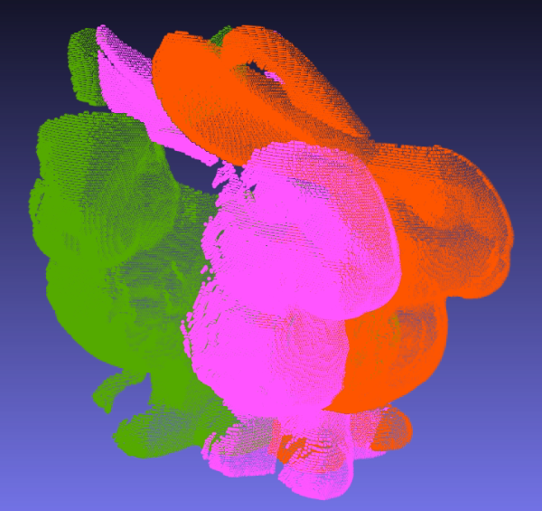
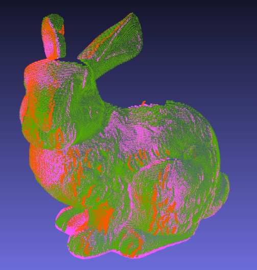
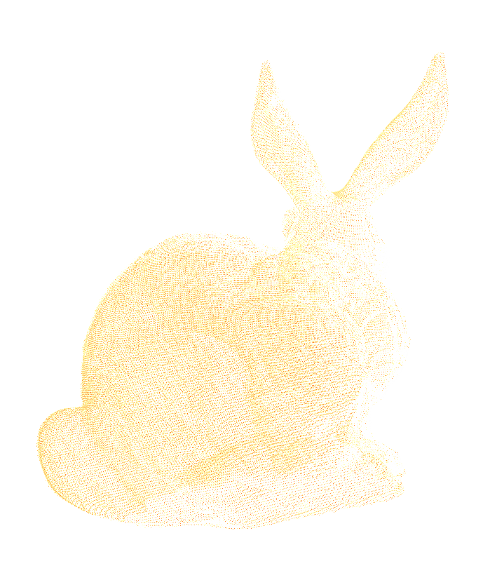
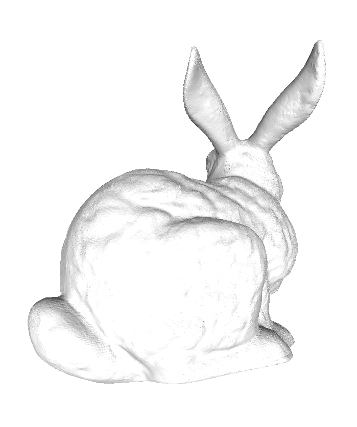
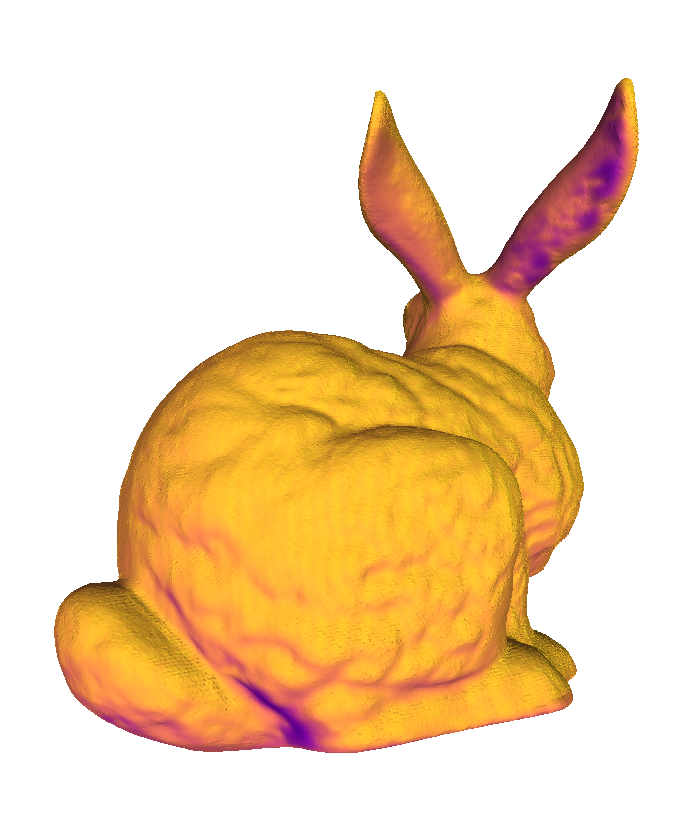
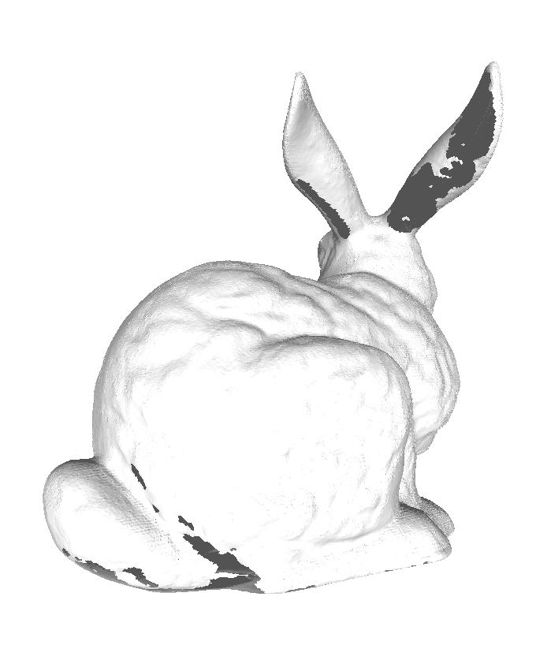

# Stanford Reconstruction

"[The Stanford 3D Scanning Repository](http://graphics.stanford.edu/data/3Dscanrep/)" で提供されているレンジスキャンデータの表面再構成のためのpythonスクリプト。

動作環境
```
numpy
open3d
pymeshlab==2021.10  # 2022.2以降ではフィルタ名が大幅に変更されているため、大量の警告が発生する
```

## 位置合わせ

### メモ
各zipファイルには、複数のレンジスキャンデータと位置合わせのためのパラメータ（並進パラメータ、四元数）が与えられている。

`align.py`では、四元数(quaternion) `qx, qy, qz, qw` を
$3 \times 3$
の回転行列に変換し、最後に並進パラメータを加算して位置合わせする。

提供元のbunnyモデルでは、四元数の符号が一部誤っており、正しく位置合わせができない。本スクリプトではパラメータを修正してある。
```
. scripts/bunny_align.sh
```

<table>
  <tr>
    <td width="48%">位置合わせ前</td>
    <td width="48%">位置合わせ後</td>
  </tr>
  <tr>
    <td width="48%"></td>
    <td width="48%"></td>
  </tr>
</table>

## 表面再構成
### 現状の問題点
open3dの頂点法線推定とpymeshlabの点群密度推定がうまく機能しないため、現状両者が入り乱れたコードになっている。
- open3dの頂点法線推定：向きに一貫性がなくなる（なぜかmeshlabでは同じパラメータで一貫性のある頂点法線が計算できる）
- meshlabの点群密度推定：フィルタ `estimate_radius_from_density` をかけても頂点の近傍半径が0のままになる。

### メモ

Poisson surface reconstructionでは点群密度の低い領域（スキャナでデータが取得されなかった領域）にも表面が生成される。そこで、頂点の近傍半径から頂点密度マップを生成し、密度が閾値以下である頂点を欠落させることで、密度の低い頂点を除去する。
 

```
. scripts/bunny_recon.sh
```

<table>
  <tr>
    <td width="24%">位置合わせ済点群</td>
    <td width="24%">表面再構成</td>
    <td width="24%">頂点密度マップ</td>
    <td width="24%">最終出力</td>
  </tr>
  <tr>
    <td width="24%"></td>
    <td width="24%"></td>
    <td width="24%"></td>
    <td width="24%"></td>
  </tr>
</table>

___

## 参考

- https://www.cs.jhu.edu/~misha/Code/PoissonRecon/Version13.8/
- https://stackoverflow.com/a/56720312